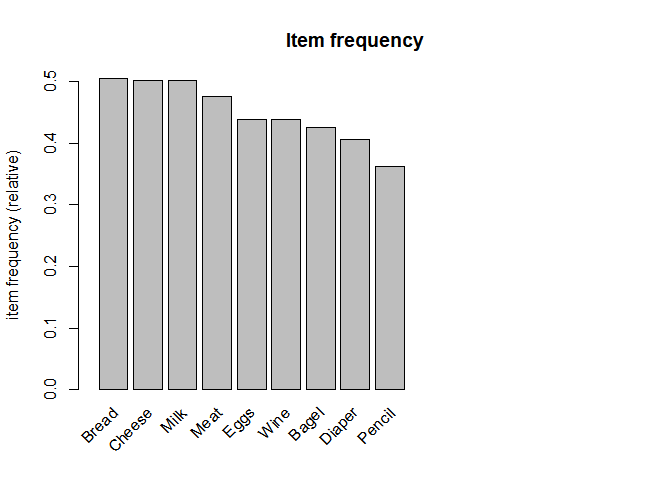
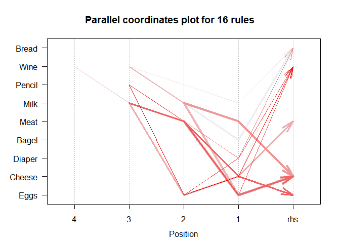
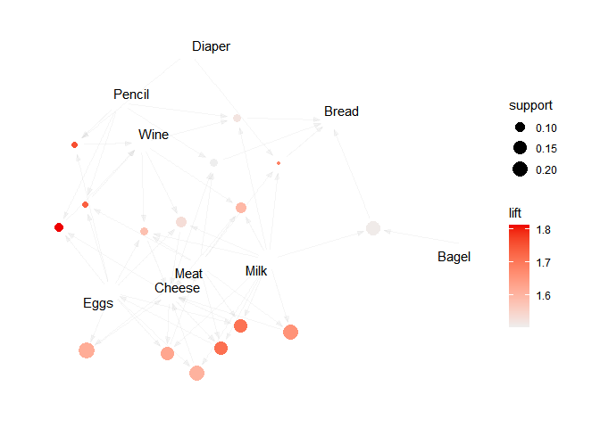

# **Introduction**
<div style="text-align: justify">
What are the Association Rules? Association rules is a machine learning method used for finding relatations in the data. With a help of association rule learning one can identify strong **rules** in database using measures like **support**, **confidence** and **lift**.^[https://en.wikipedia.org/wiki/Association_rule_learning] One of its uses are recommendation systems, like the one implemented by Netflix. Netflix creates personalised list of recommended movies for every user. Based upon user watch history, his likes and dislikes they recommend movies he may like.  can be used in recommendation systems (80% of Netflix views are from the service’s recommendation).^[https://www.kaggle.com/mathchi/association-rules-on-business-problem/notebook]</br>
In the following paper, with the help of association rules I will try to discover the relationships between shopping baskets and indicate which products imply the purchase of other products. The data for this paper was downloaded from Kaggle [website](https://www.kaggle.com/mathchi/association-rules-on-business-problem/data). The dataset contains information on the 315 transactions, including different products such bagels, cheese, diapers, eggs, milk.
</div>

#### Load neccessary libraries

```r
library(arules)
library(arulesViz)
library(arulesCBA)
```

# **Basic descriptive statistics**
#### Read the data


<div style="text-align: justify">
Let’s take a look at some basic descriptive statistics of the dataset.
</div>


```r
summary(df)
```

```
## transactions as itemMatrix in sparse format with
##  315 rows (elements/itemsets/transactions) and
##  9 columns (items) and a density of 0.4504409 
## 
## most frequent items:
##   Bread  Cheese    Milk    Meat    Eggs (Other) 
##     159     158     158     150     138     514 
## 
## element (itemset/transaction) length distribution:
## sizes
##  1  2  3  4  5  6  7 
## 30 40 58 54 62 30 41 
## 
##    Min. 1st Qu.  Median    Mean 3rd Qu.    Max. 
##   1.000   3.000   4.000   4.054   5.000   7.000 
## 
## includes extended item information - examples:
##   labels
## 1  Bagel
## 2  Bread
## 3 Cheese
```

<div style="text-align: justify">
One can observe that most frequent items are bread (159 occurenes), cheese (158), milk (158), meat (150) and eggs (138). Other items account for 514 records in total.</br>
</br>
Similarly, the frequency of items in the baskets is shown in the the relative item frequency barplot below.
</div>

<!-- -->

# **Apriori algorithm**
<div style="text-align: justify">
As I have mentioned before, association rule can identify strong rules in database using measures like support, confidence and lift. Below, one can find the formulas with the help of which these measures can be calculated.

$$support(X) = \frac{count(X)}{N}$$
Support measures how frequently an itemset or a rule occurs in the data. <i>X</i> indicates the number of transactions the itemset X appers in. <i>N</i> is the number of transactions in the
database.

$$confidence(X \rightarrow Y) = \frac{support(X,Y)}{support(X)}$$
Confidence is the percentage in which the consequent is also satisfied upon particular antecedent. The proportion of transactions where the presence of item or itemset X results in the presence of item
or itemset Y.

$$lift(X \rightarrow Y) = \frac{confidence(X \rightarrow Y)}{support(Y)}$$
Lift controls for the support (frequency) of consequent while calculating the conditional probability of occurrence of {Y} given {X}. the rise in probability of having {Y} on the cart with the knowledge of {X} being present over the probability of having {Y} on the cart without any knowledge about presence of {X}.</br>
</br>
Let's find the association rules using the apriori algorithm.
</div>


```r
rules <- apriori(df) 
```

```
## Apriori
## 
## Parameter specification:
##  confidence minval smax arem  aval originalSupport maxtime support minlen
##         0.8    0.1    1 none FALSE            TRUE       5     0.1      1
##  maxlen target  ext
##      10  rules TRUE
## 
## Algorithmic control:
##  filter tree heap memopt load sort verbose
##     0.1 TRUE TRUE  FALSE TRUE    2    TRUE
## 
## Absolute minimum support count: 31 
## 
## set item appearances ...[0 item(s)] done [0.00s].
## set transactions ...[9 item(s), 315 transaction(s)] done [0.00s].
## sorting and recoding items ... [9 item(s)] done [0.00s].
## creating transaction tree ... done [0.00s].
## checking subsets of size 1 2 3 4 done [0.00s].
## writing ... [5 rule(s)] done [0.00s].
## creating S4 object  ... done [0.00s].
```

<div style="text-align: justify">
One can observe that running apriori algorithm with default parameters results with 5 rules.</br>
</br>
I change parameters in order to obtain more rules. Setting the support to 0.05, confidence to 0.75 and minimal length to 2 results in obtaining 16 rules.
</div>


```r
rules <- apriori(df, parameter=list(supp=0.05, conf=0.75, minlen=2)) 
```

```
## Apriori
## 
## Parameter specification:
##  confidence minval smax arem  aval originalSupport maxtime support minlen
##        0.75    0.1    1 none FALSE            TRUE       5    0.05      2
##  maxlen target  ext
##      10  rules TRUE
## 
## Algorithmic control:
##  filter tree heap memopt load sort verbose
##     0.1 TRUE TRUE  FALSE TRUE    2    TRUE
## 
## Absolute minimum support count: 15 
## 
## set item appearances ...[0 item(s)] done [0.00s].
## set transactions ...[9 item(s), 315 transaction(s)] done [0.00s].
## sorting and recoding items ... [9 item(s)] done [0.00s].
## creating transaction tree ... done [0.00s].
## checking subsets of size 1 2 3 4 5 done [0.00s].
## writing ... [16 rule(s)] done [0.00s].
## creating S4 object  ... done [0.00s].
```

<div style="text-align: justify">
Below, one can observe the visualizations of found rules.
</div>

<!-- -->

<!-- -->

<div style="text-align: justify">
In order to get a deeper into obtained rules, one can sort the results by a specific metric (support, confidence or lift).
</div>


```r
inspect(sort(rules, by = "support")[1:5], linebreak = FALSE)
```

```
##     lhs                   rhs      support   confidence coverage  lift    
## [1] {Eggs, Meat}       => {Cheese} 0.2158730 0.8095238  0.2666667 1.613924
## [2] {Meat, Milk}       => {Cheese} 0.2031746 0.8311688  0.2444444 1.657077
## [3] {Eggs, Milk}       => {Cheese} 0.1968254 0.8051948  0.2444444 1.605293
## [4] {Bagel, Milk}      => {Bread}  0.1714286 0.7605634  0.2253968 1.506777
## [5] {Eggs, Meat, Milk} => {Cheese} 0.1523810 0.8571429  0.1777778 1.708861
##     count
## [1] 68   
## [2] 64   
## [3] 62   
## [4] 54   
## [5] 48
```

<div style="text-align: justify">
Rules sorted by the support show what transactions were the most common ones. One can interpret the results that set of eggs, meat and cheese occurs in 21.6% of total transactions. Respectively, meat, milk and cheese occurs in 20.3% of total transactions.
</div>


```r
inspect(sort(rules, by = "confidence")[1:5], linebreak = FALSE)
```

```
##     lhs                     rhs      support    confidence coverage   lift    
## [1] {Eggs, Meat, Milk}   => {Cheese} 0.15238095 0.8571429  0.17777778 1.708861
## [2] {Diaper, Meat, Milk} => {Bread}  0.05396825 0.8500000  0.06349206 1.683962
## [3] {Meat, Milk}         => {Cheese} 0.20317460 0.8311688  0.24444444 1.657077
## [4] {Eggs, Meat}         => {Cheese} 0.21587302 0.8095238  0.26666667 1.613924
## [5] {Eggs, Milk}         => {Cheese} 0.19682540 0.8051948  0.24444444 1.605293
##     count
## [1] 48   
## [2] 17   
## [3] 64   
## [4] 68   
## [5] 62
```

<div style="text-align: justify">
By sorting rules by the confidence can see which of them are the most probable. The result can be interpreted in a way that when a consumer buys set of eggs, meat and milk, with a probability of 86% they will also buy cheese. Similarly, if a customer buys diaper, meat and milk, with a probability of 85% they will also buy bread. And further, buying a set of meat and milk has a 83% probability of leading to the purchase of cheese.
</div>


```r
inspect(sort(rules, by = "lift")[1:5], linebreak = FALSE)
```

```
##     lhs                       rhs      support    confidence coverage  
## [1] {Cheese, Eggs, Pencil} => {Wine}   0.08571429 0.7941176  0.10793651
## [2] {Diaper, Eggs, Pencil} => {Wine}   0.06349206 0.7692308  0.08253968
## [3] {Eggs, Meat, Pencil}   => {Wine}   0.06031746 0.7600000  0.07936508
## [4] {Cheese, Meat, Milk}   => {Eggs}   0.15238095 0.7500000  0.20317460
## [5] {Eggs, Meat, Milk}     => {Cheese} 0.15238095 0.8571429  0.17777778
##     lift     count
## [1] 1.812660 27   
## [2] 1.755853 20   
## [3] 1.734783 19   
## [4] 1.711957 48   
## [5] 1.708861 48
```

<div style="text-align: justify">
The lift metric shows with which items a product is more often bought together than separately. Value of the lift for each rule exceeds 1. It means that wine is more likely to be bought with a set of cheese, eggs and pencil than to be bought separately. Analogously for the set of diaper, eggs and pencil, with which wine was bought more often than bought separately.
</div>


```r
rules_wine <- apriori(data=df, parameter=list(supp=0.05,conf = 0.75, minlen=2), appearance=list(default="lhs", rhs="Wine"), control=list(verbose=F)) 
rules_wine_byconf <- sort(rules_wine, by="confidence", decreasing=TRUE)
inspect((rules_wine_byconf)[1:3], linebreak = FALSE)
```

```
##     lhs                       rhs    support    confidence coverage   lift    
## [1] {Cheese, Eggs, Pencil} => {Wine} 0.08571429 0.7941176  0.10793651 1.812660
## [2] {Diaper, Eggs, Pencil} => {Wine} 0.06349206 0.7692308  0.08253968 1.755853
## [3] {Eggs, Meat, Pencil}   => {Wine} 0.06031746 0.7600000  0.07936508 1.734783
##     count
## [1] 27   
## [2] 20   
## [3] 19
```

<div style="text-align: justify">
It is also possible to explore the rules for selected products. Above you can see the three rules for buying wine sorted by confidence.
</div>

# **ECLAT algorithm**
<div style="text-align: justify">
Another algorithm that can be used for association is ECLAT (Equivalence Class Clustering and bottom-up Lattice Traversal). This algorithm competes with Apriori algorithm in terms of speed of computation. As no rules are created in this case and the metrics (confidence, lift) needed to interpret the alternative models are not counted, the computation time is faster. As a result, we obtain frequent sets and measure values determined for them (e.g. support).</br>
</br>
I will start by running the algorithm with the following parameter thresholds: support=0.25, minlen=2, maxlen=10.
</div>


```r
freq.items <- eclat(df, parameter=list(supp=0.25, minlen=2, maxlen=10)) 
```

```
## Eclat
## 
## parameter specification:
##  tidLists support minlen maxlen            target  ext
##     FALSE    0.25      2     10 frequent itemsets TRUE
## 
## algorithmic control:
##  sparse sort verbose
##       7   -2    TRUE
## 
## Absolute minimum support count: 78 
## 
## create itemset ... 
## set transactions ...[9 item(s), 315 transaction(s)] done [0.00s].
## sorting and recoding items ... [9 item(s)] done [0.00s].
## creating bit matrix ... [9 row(s), 315 column(s)] done [0.00s].
## writing  ... [8 set(s)] done [0.00s].
## Creating S4 object  ... done [0.00s].
```

<div style="text-align: justify">
As a result, I got 8 sets. 
</div>


```r
inspect(sort(freq.items, by = "support"))
```

```
##     items          support   count
## [1] {Cheese, Meat} 0.3238095 102  
## [2] {Cheese, Milk} 0.3047619  96  
## [3] {Cheese, Eggs} 0.2984127  94  
## [4] {Bagel, Bread} 0.2793651  88  
## [5] {Bread, Milk}  0.2793651  88  
## [6] {Cheese, Wine} 0.2698413  85  
## [7] {Eggs, Meat}   0.2666667  84  
## [8] {Meat, Wine}   0.2507937  79
```

<div style="text-align: justify">
The most common set turned out to be cheese and meat (32.4%), followed by cheese and milk (30.5%), cheese and eggs (29.8%), and so on.
</div>


```r
freq.rules <- ruleInduction(freq.items, df, confidence=0.6)
inspect(sort(freq.rules, by = "confidence"))
```

```
##     lhs         rhs      support   confidence lift     itemset
## [1] {Eggs}   => {Cheese} 0.2984127 0.6811594  1.358008 2      
## [2] {Meat}   => {Cheese} 0.3238095 0.6800000  1.355696 6      
## [3] {Bagel}  => {Bread}  0.2793651 0.6567164  1.301042 1      
## [4] {Cheese} => {Meat}   0.3238095 0.6455696  1.355696 6      
## [5] {Wine}   => {Cheese} 0.2698413 0.6159420  1.227986 4      
## [6] {Eggs}   => {Meat}   0.2666667 0.6086957  1.278261 3      
## [7] {Milk}   => {Cheese} 0.3047619 0.6075949  1.211344 7      
## [8] {Cheese} => {Milk}   0.3047619 0.6075949  1.211344 7
```

<div style="text-align: justify">
Interpreting the results, the probability that along with buying eggs, the customer will also buy cheese is 68%. Similarly for the other sets.
</div>

# **Conclusion**
<div style="text-align: justify">
Both using Apriori algorithm and ECLAT algorithm produced results that seem to agree with reality. The results are consistent with intuition and appear to be correct. I used two algorithms in this paper: Apriori algorithm and ECLAT algorithm. Apriori algorithm is slower, but gives more useful metrics and uses less memory than the ECLAT. ECLAT is faster, but does not give as many metrics as Apriori algorithm.
</div>
